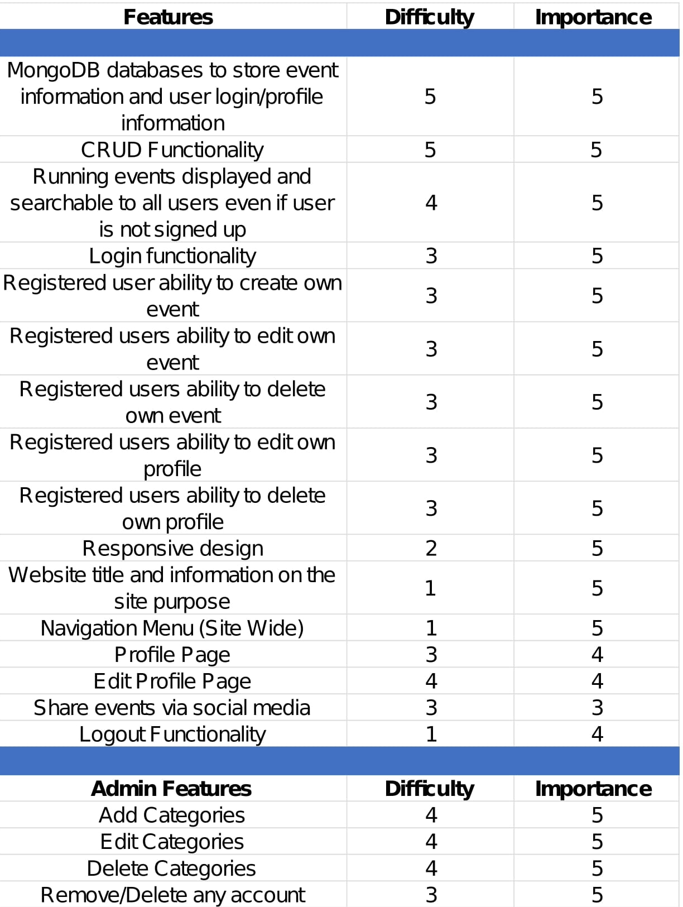

# RUN||actua||y

Run actually is a event finder site for people passionate about the art of running fitness & health and in general. I't all about getting people outdoors and active. The live site will be found #here.

### Mockup will be found #here.

## Table of Content
* [User Experience Design (UX)](#User-Experience-Design)
    * [The Strategy Plane](#The-Strategy-Plane)
        * [Site Goals](#Site-Goals)
        * [User stories](#User-Stories)
    * [The Scope Plane](#The-Scope-Plane)
    * [The Structure Plane](#The-Structure-Plane)
    * [The Skeleton Plane](#The-Skeleton-Plane)
        * [Wireframes](#Wireframes)
        * [Database Design](#Database-Design)
        * [Security](#Security)
    * [The Surface Plane](#The-Surface-Plane)
        * [Design](#Design)
            * [Colour Scheme](#Colour-Scheme)
            * [Typography](#Typography)
            * [Imagery](#Imagery)
    * [Differences to Design](#Differences-to-Design)
- [Features](#Features)
    * [Existing Features](#Existing-Features)
    * [Future Features](#Features-Left-to-Implement)
* [Technologies](#Technologies)
* [Testing](#Testing)
    * [Test Strategy](#Test-Strategy)
    * [Test Results](#Test-Results)
    * [Isses and Resolutions](#Issues-and-Resolutions-to-issues-found-during-testing)
* [Deployment](#Deployment)
    * [Project Creation](#Project-Creation)
    * [GitHub Pages](#Deployment-To-Heroku)
    * [Run Locally](#Run-Locally)
    * [Fork Project](#Fork-Project)
* [Credits](#Credits)
  * [Code](#Code)
  * [Acknowledgements](#Acknowledgements)

  ****

## User Experience Design
### **The Strategy Plane**

This website was created for for the sole purpose of compleating my MS3 for the "Code Institue's" full stack software developer program. At the same time I am a avid runnner so I thought it would be cool to create a runners event site that I my self would use to find, create and particapate in the events. The aim is to provide users with a website that allows them to quickly find and sing up for, or create Runners Events that can be shared with other runner enthusiasts. All historical events should be recorded, although they do not have to be displayed as this data will not be needed until phase two enhancements of the website.
#### Site Goals
* To increase the number of participants in runners events by providing a simple, easy to use website that
contains all the details of upcoming events.
* Charities play a vital role in our lives and communities and Charities rely on fundraising to keep doing their work. Taking on a challenge is the perfect opportunity to start fundraising. This site give organizations and/or indivduals the opportunity to create charity runns so support great causes.
* Maintaining good health doesn't happen by accident. It requires work, smart lifestyle choices and Physical exercise. Exercise is important for people with mental illness – it not only boosts our mood, concentration and alertness, but improves our cardiovascular and overall physical health. This site is all about promoting a healther way of life.

#### User stories
* As a user, I want the main purpose of the site to be clear so that I immediately know what the site is 
intended for upon entering.
* As a user, I want to easily navigate the site so that I can find content quickly with ease.
* As a user, I want the website to be responsive so that I can clearly view the webpages from my mobile, 
tablet or desktop.
* As a user, I want to be able to register to the website so that I can create and manage my own events.
* As a user, I want to be able to search or filter events based on custom criteria so that I can find events
 suited to me.
* As a user, I want a way to contact the site owner so that I can have any questions I may have in 
regards to the website answered.
* As a user, I want to be able to return to the main site without having to use the browser buttons so 
that I can easily return to the website if I navigate to a page that doesn't exist.

### **The Scope Plane**

**Features planned:**
* Responsive design.
* Website title and information on the site purpose.
* Navigation Menu (Site Wide).
* Footer with links (Site Wide).
* MongoDB databases to store event information and user login/profile information.
* CRUD Functionality.
* Login functionality.
* Logout functionality.
* Profile Page.
* Edit Profile Page.
* Runners events displayed and searchable to all users.
* Registered user event creation and management.
* Admin ability to add, edit, delete categories.
* Admin ability to delete user account.

