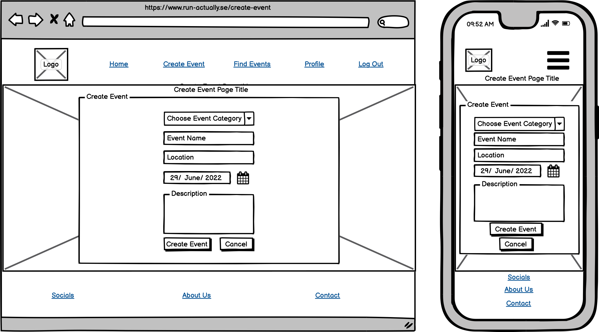
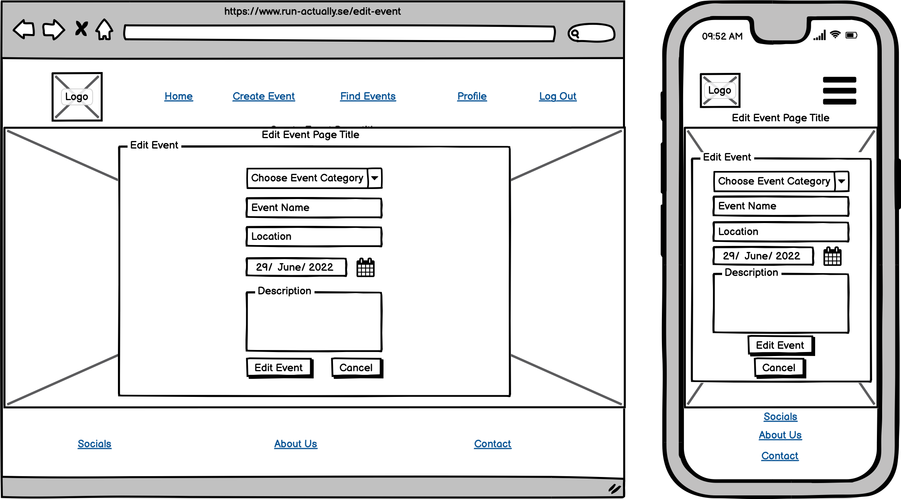

# RUN||actually 

Run actually is a runners event finder site and our main objective is to get people off the sofa and enjoying being outdoors.We just love to run and we hope you will too after experiencing life on the trails.The live site can be found [here](https://run-actually.herokuapp.com/)

## Table of Content
* [User Experience Design (UX)](#User-Experience-Design)
    * [The Strategy Plane](#The-Strategy-Plane)
        * [Site Goals](#Site-Goals)
        * [User stories](#User-Stories)
    * [The Scope Plane](#The-Scope-Plane)
    * [The Structure Plane](#The-Structure-Plane)
    * [The Skeleton Plane](#The-Skeleton-Plane)
        * [Wireframes](#Wireframes)
        * [Database Design](#Database-Design)
        * [Security](#Security)
    * [The Surface Plane](#The-Surface-Plane)
        * [Design](#Design)
            * [Colour Scheme](#Colour-Scheme)
            * [Typography](#Typography)
            * [Imagery](#Imagery)
    * [Differences to Design](#Differences-to-Design)
- [Features](#Features)
    * [Existing Features](#Existing-Features)
    * [Future Features](#Features-Left-to-Implement)
* [Technologies](#Technologies)
* [Testing](#Testing)
    * [Test Strategy](#Test-Strategy)
    * [Test Results](#Test-Results)
    * [Isses and Resolutions](#Issues-and-Resolutions-to-issues-found-during-testing)
* [Deployment](#Deployment)
    * [Project Creation](#Project-Creation)
    * [GitHub Pages](#Deployment-To-Heroku)
    * [Run Locally](#Run-Locally)
    * [Fork Project](#Fork-Project)
* [Credits](#Credits)
  * [Code](#Code)
  * [Acknowledgements](#Acknowledgements)

  ****

## User Experience Design
### **The Strategy Plane**

This website was created for for the sole purpose of compleating my MS3 for the "Code Institue's" full stack software developer program. At the same time I am a avid runnner so I thought it would be cool to create a runners event site that I my self would use to find, create and particapate in the events. The aim is to provide users with a website that allows them to quickly find and sing up for, or create Runners Events that can be shared with other runner enthusiasts. All historical events should be recorded, although they do not have to be displayed as this data will not be needed until phase two enhancements of the website.
#### Site Goals
* To increase the number of participants in runners events by providing a simple, easy to use website that
contains all the details of upcoming events.
* Charities play a vital role in our lives and communities and Charities rely on fundraising to keep doing their work. Taking on a challenge is the perfect opportunity to start fundraising. This site give organizations and/or indivduals the opportunity to create charity runns so support great causes.
* Maintaining good health doesn't happen by accident. It requires work, smart lifestyle choices and Physical exercise. Exercise is important for people with mental illness – it not only boosts our mood, concentration and alertness, but improves our cardiovascular and overall physical health. This site is all about promoting a healther way of life.

#### User stories
* As a user, I want the main purpose of the site to be clear so that I immediately know what the site is 
intended for upon entering.
* As a user, I want to easily navigate the site so that I can find content quickly with ease.
* As a user, I want the website to be responsive so that I can clearly view the webpages from my mobile, 
tablet or desktop.
* As a user, I want to be able to register to the website so that I can create and manage my own events.
* As a user, I want to be able to search or filter events based on custom criteria so that I can find events
 suited to me.
* As a user, I want a way to contact the site owner so that I can have any questions I may have in 
regards to the website answered.
* As a user, I want to be able to return to the main site without having to use the browser buttons so 
that I can easily return to the website if I navigate to a page that doesn't exist.

### **The Scope Plane**

**Features planned:**
* Responsive design.
* Website title and information on the site purpose.
* Navigation Menu (Site Wide).
* Footer with links (Site Wide).
* MongoDB databases to store event information and user login/profile information.
* CRUD Functionality.
* Login functionality.
* Logout functionality.
* Profile Page.
* Edit Profile Page.
* Runners events displayed and searchable to all users.
* Registered user event creation and management.
* Admin ability to add, edit, delete categories.
* Admin ability to delete user account.

### **The Structure Plane**
User Story:
> As a user, I want the main purpose of the site to be clear so that I immediately know what the site is 
intended for upon entering.

Acceptance Criteria:
* Site Logo to be displayed on the main navigation bar on all pages.
* Home Page to display Website Title and information to the user on the purpose of the site.

Implementation:

A site logo will be displayed on the main navigation menu. This should be 
displayed on all webpages.

The Website title will be displated as a h3 element on the home page and a description of the site will be displayed on the Home page so that is evident of the websites purpose as soon as the user visits the site.

User Story:
> As a user, I want to easily navigate the site so that I can find content quickly with ease.

Acceptance Criteria:
* Navigation menu to be displayed on all pages.
* All navigation links redirect to the correct pages.

Implementation:

A navigation menu will be displayed on all webpages. This will redirect users to the approriate page when 
clicked. On smaller devices, the menu will collapse into a hamburger menu to make efficient use to screen 
space. When clicked, the menu will expand out from the right side of the screen displaying all nav items.

The following navigation items will be implemented in the main menu when user is not logged in:

* Home - index.html
* Events - get_events.html
* Sign Up - register.html
* Log In - login.html

The following navigation items will be implemented in the main menu when user is logged in:
* Home - index.html
* Events - get_events.html
* Create Event - create-event.html
* Profile - profile.html
* Log Out - (redirects to home page)

The following navigation buttons will be implemented on the Profile page when user is logged in:
* Edit Profile - profile.html
* Update Profile - edit_profile.html

The following navigation items will be implemented in the footer section they at all time:
* Social Media Links
* About Us - about.html
* Contact - contact.html

User Story:
> As a user, I want the website to be responsive so that I can clearly view the webpages from my mobile, 
tablet or desktop.

Acceptance Criteria:
* Content should be responsive and display clearly on all devices with no horizontal scroll.

Implementation:

Materialize will be used for website layout with suitable column sizes and containers to ensure
that all content is displayed clearly on all devices with no horizonal scroll. Images will be responsive and 
scale to fit screen sizes with no stretch or distortion to ensure clear images are displayed to the user.

User Story:
> As a user, I want to be able to register to the website so that I can create and manage my own events.

Acceptance Criteria:
* Sign up - Login and Logout functionality to be added.
* User must have the ability to create, update and delete their own events.
* User must have a profile page displaying their basic details.
* Creator of an event should have the ability to update or delete the events.

Implementation:

A Sign Up page will be implemented that allows users to register for an account on the website. The username
and password along with basic details for the users account will be stored in a MongoDB database collection 
called users. In order to create or modify events, a user will have to register and login to the website. 
Only the creator of the event will have the ability to update or delete the event, this is to prevent 
unwanted modification or deletion of events by other users. A flash message will be shown to the user to 
alert them whether the update or delete on their event was successful or failed.

A Sign In page will be implemented to allow registered users the ability to login in to their account. 

Once a user has successfully logged in, they will be redirected to the events page. The user will there have the ability to search the data base for upcoming events,

A Log Out button will be displayed to users who are logged in. When clicked this will log out the user out of the website and redirect them to the log in page.

A Create Event page will be implemented that will be acessible and visible on the navigation menu to logged 
in users. The user will be able to create an event from this page. The event information will be stored in 
a MongoDB database collection called events and the event categories will be stored in a MongoDB collection 
called categories.

User Story:
> As a user, I want to be able to search or filter events based on custom criteria so that I can find events
 suited to me.

Acceptance Criteria:
* Events must be displayed to all users regardless of being logged in.
* Users should be able to search for events by Event name, Location or Event Category.

Implementation:

An Events page will be implemented that is displayed to all users that is accessible to logged in or guests. 
This page will display the all Runners events from today's date on a materialize collapsible element. In order to make use of space, these events will be collapsable and can be expanded to view details on click.

A search box will be displayed on screen which will allow users to search for events based on Event name, Event 
Category or Location. This will return a filtered, full list events for the current search criteria. 
This will be implemented by using a database index that will be created on the MongoDB collection events.

User Story:
> As a user, I want a way to contact the site owner so that I can have any questions I may have in 
regards to the website answered and receive feedback to alert on status of form submission.

Acceptance Criteria:
* Contact page should be added with a contact form. This form should only submit with valid data input.
* Contact form should not submit with invalid data input.
* User should be alerted of success/failure status of form submission.

Implementation:

A contact page will be added that contains a materialize form, this will allow users to contact the site 
owner. The EmailJS API will be used in order to implement this feature and a flash message will be 
displayed to alert the user if the contact form submitted successfully or unsuccessfully.

Validation will be performed on the form to ensure valid data input. The form will not submit if any 
field is blank.

Form Fields:
* Name - Type: Text, required.
* Email - Type: Email, required.
* Comments - Type: TextArea, required.

User Story:
> As a user, I want to be able to return to the main site without having to use the browser buttons so 
that I can easily return to the website if I navigate to a page that doesn't exist.

Acceptance Criteria:
* If a user redirects to the wrong page, an error will display that contains a link to go back to the main 
website.

Implementation:

A custom 404 page will be created so that if a user attempts to navigate to a page that it not found, an 
error will be displayed. This page will contain a clickable anchor link to allow the user to redirect to 
the main website without needing to use the browser navigation buttons.

### **The Skeleton Plane**
#### Wireframes PNG Format

Home: 
 
404: 
 
Contact: 
 
About: 
 
Create Event: 
 
Edit Event: 
 
Events: 
 
Profile 
 
Edit Profile 
 
Log In: 
 
Sign Up 
 

#### Wireframes PDF Format

* [Home](readme_images/wireframes_pdf/home.pdf)
* [404](readme_images/wireframes_pdf/404.pdf)
* [Contact](readme_images/wireframes_pdf/contact.pdf)
* [About](readme_images/wireframes_pdf/about.pdf)
* [Create Event](readme_images/wireframes_pdf/create-event.pdf)
* [Edit Event](readme_images/wireframes_pdf/edit-event.pdf)
* [Events](readme_images/wireframes_pdf/events.pdf)
* [Profile](readme_images/wireframes_pdf/profile.pdf)
* [Edit Profile](readme_images/wireframes_pdf/edit-profile.pdf)
* [Log In](readme_images/wireframes_pdf/signin.pdf)
* [Sign Up](readme_images/wireframes_pdf/signup.pdf)

#### Database Design
MongoDB Object format examples:

**Collection: categories** 
{ 
_id: unique-value, 
category_name: "Mud Runs" 
}

**Collection: events** 
{ 
_id: unique-value, 
category_name: "5k Runs" 
date: "30 December, 2021" 
event_description: "Just a nice 5k run for the k-9's" 
event_name :"Muddle in puddle" 
is_urgent: "on" 
location: "Helsingborg, Sweden" 
created_by: "Admin 
}

**Collection: users** 
{ 
_id: unique-value, 
name: "ivanmurraineulysses" 
username: "admin" 
eamil: "murraine8@gmail.com" 
password:***************** 
}
#### Security

Database connection details are set up in an [env.py](https://pypi.org/project/env.py/) for development, for 
security reasons this is not uploaded to GitHub so that database and connection details are not visible to 
users. In production these are stored in Heroku. 

### **The Surface Plane**
### Design

#### Planned Colour Scheme
The main background colours are a grey-blue color #78909c  all buttons and h3 headings  are green #136259 
 
The main website text is black #000 
#### Typography
The title page font used for the webpage is 'Permanent Marker' and the plain text for the rest of the site is the font 'Montserrat'. 

#### Imagery
The background image used on all pages is taken with permission from a [Unsplash](https://unsplash.com/) contributar by the name of Alessio Soggetti see his fine work [Here](https://unsplash.com/@asoggetti)  

The website logo was created using online software from the website [Canva](https://www.canva.com/).

## Difference in design
* Some of the design was changed during the development process. 
Some features in the profile page have postponed to the next itteration of the webiste, e.g. user ability to update profile page. 

* The 404 page was changed to another design from the  original design.

* The 400 Error page was not included in the original design but was implemented with the same page layout as the 404 page to account for any bad request errors.

* The 500 Error page was not included in the original design but was implemented with the same page layout as the 404 page to account for any internal server errors.

* Additional verification was added to the delete event button for the user to confirm they want to delete the event. This was added so the user doesn't accidentally delete an event and was implemented using a modal with the option to cancel or delete.

* Additional verification was added to the delete category button for the site owner to confirm they want to delete a category. This was added so the user doesn't accidentally delete an event and was implemented using a modal with the option to cancel or delete.

* The About page was changed to another design for a better user experience.

* The hero image on the index page was changed to fullscreen video for a better user experience.

## Features

### Existing features
* Admin log-in
* Home page displaying full screen video and information about the purpose of the site.
* User's ability to sign up.
* User's ability to log in and log out function.
* User's ability to create events.
* User's ability to edit events.
* User's ability to delate events created by user.
* Event page that displays all upcoming events.
* User's ability to search for events in the data base, via a search field.
* Create event page allowing signed in users to create events.
* Mobile responsive design. 
* Contact page with form and EmailJS function so that user can contact site owner.
* Site wide navbar footer containing links to contact form, about page and copyright information.

### Features left to implement
* User's ability to upload images
* Map API to locate race events
* Race alert to alert users of upcoming races
* Ability to sign-up for newsletter

## Technologies
* [HTML](https://en.wikipedia.org/wiki/HTML)
	* This project uses HTML as the main language used to complete the structure of the Website.
* [CSS](https://en.wikipedia.org/wiki/CSS)
	* This project uses custom written CSS to style the Website.
* [JavaScript](https://en.wikipedia.org/wiki/JavaScript)
    * JavaScript is used along with [emailjs](https://www.emailjs.com/) for the contact form. This sends an email to the site owner
    on form submit.
    * [jQuery](https://jquery.com/) is used for the following: 
        * Mobile side nav
        * Displaying Success/Fail message verifying contact form status.
        * Collapsible Materialize elements.
        * Materialize modal.
        * Datepicker functionality on forms.
        * To populate downdrops on select elements.
* [Python](https://www.python.org/)
    * This projects core was created using Python, the back-end logic and the means to run/view the Website.
    * Python Modules used (These can be found in the requirements.txt project file):
        * click==8.0.3
        * csrf==0.1b1
        * dnspython==2.0.0
        * Flask==1.1.2
        * Flask-PyMongo==2.3.0
        * Flask-WTF==0.14.3
        * itsdangerous==1.1.0
        * pymongo==3.11.2
        * simplejson==3.17.6
        * Werkzeug==1.0.1
        * WTForms==2.3.3  

* [Materialize](https://materializecss.com/)
    * The Materialize framework was used through the website for layout and responsiveness.
* [Google Fonts](https://fonts.google.com/)
	* Google fonts are used throughout the project to import the *Inter* and *Bevan* fonts.
 * [Git](https://git-scm.com/)
	* Git is used as version control software to commit and push code to the GitHub repository where the source code is stored.
* [GitHub](https://github.com/)
	* GithHub is the hosting site used to store the source code for the Website.
* [MongoDB](https://www.mongodb.com/1)
    * MongoDB was used to create the document based databases(collections) used as data storage for this project.
* [Heroku](https://dashboard.heroku.com/apps)
    * Heroku was used to deploy the live website.
* [TinyJPG](https://tinyjpg.com/)
	* TinyJPG/TinyPNG is used to reduce the file sizes of images before being deployed to reduce storage and bandwith.
* [Google Chrome Developer Tools](https://developers.google.com/web/tools/chrome-devtools)
	* Google chromes built in developer tools are used to inspect page elements and help debug issues with the site layout and test different CSS styles.
* [balsamiq Wireframes](https://balsamiq.com/wireframes/)
	* This was used to create wireframes for 'The Skeleton Plane' stage of UX design.
* [Canva](https://www.canva.com/)
    * Canva design was used in order to create the website logo.
* [Font Awesome](https://fontawesome.com/)
    * All the Icons displayed throughout the website are Font Awesome icons.
* [Favicon](https://favicon.io/)
    * Favicon.io was used to make the site favicon 
* [Techsini](http://techsini.com/multi-mockup/index.php)
    * Multi Device Website Mockup Generator was used to create the Mock up image in this README

## Testing

### Test Strategy
#### **Summary**
Testing is required on all features and user stories documented in this README. 
All clickable links must redirect to the correct pages. All forms linked to MongoDB
must be tested to ensure they insert all given fields into the correct collections.

#### **Access Requirements**
Tester must have access to MongoDB in order to manually verify the insertion 
of records to users and events collections.

#### **Assumptions and Dependencies**
Testing is dependent on the website being deployed live on Heroku.

### Test Results

Full test results can be found [here](https://github.com/Sonicbasedrop/run-actually/blob/main/TESTING.md)

## Deployment

### Project Creation
To create this project I used the CI Gitpod Full Template by navigating 
[here](https://github.com/Code-Institute-Org/gitpod-full-template) and clicking the 'Use this template' button.

I was then directed to the create new repository from template page and entered in my repo name, then clicked Create repository from template button.

After it was  created, I navigated to my new repository on GitHub and clicked the Gitpod button which built my workspace.

The following commands were used for version control throughout the project:

- git add *filename* - This command was used to add files to the staging area before committing.

- git commit -m "commit message explaining the updates" - This command was used to to commit changes to the local repository.

- git push - This command is used to push all committed changes to the GitHub repository.

### Deployment to Heroku

**Create application:**
1. Navigate to Heroku.com and login.
1. Click on the new button.
1. Select create new app.
1. Enter the app name.
1. Select region.

