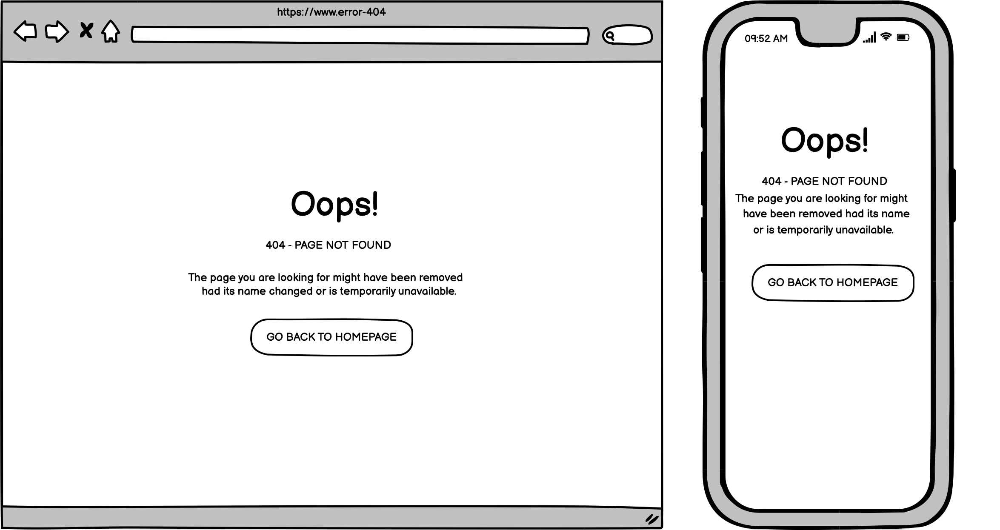
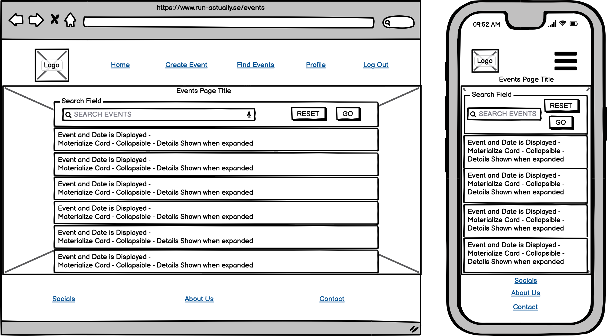
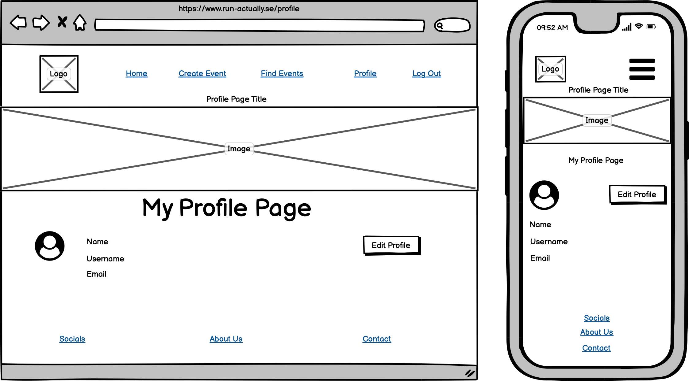
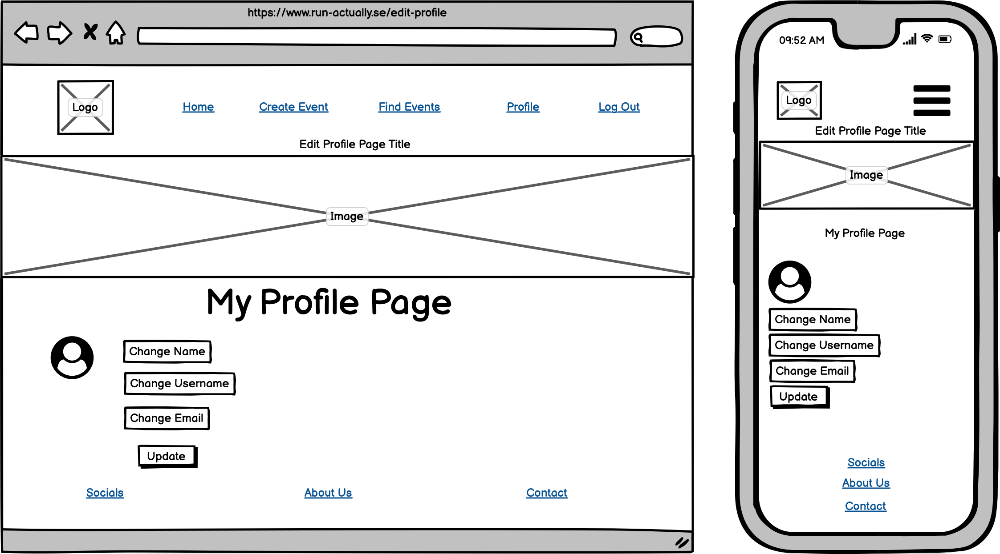
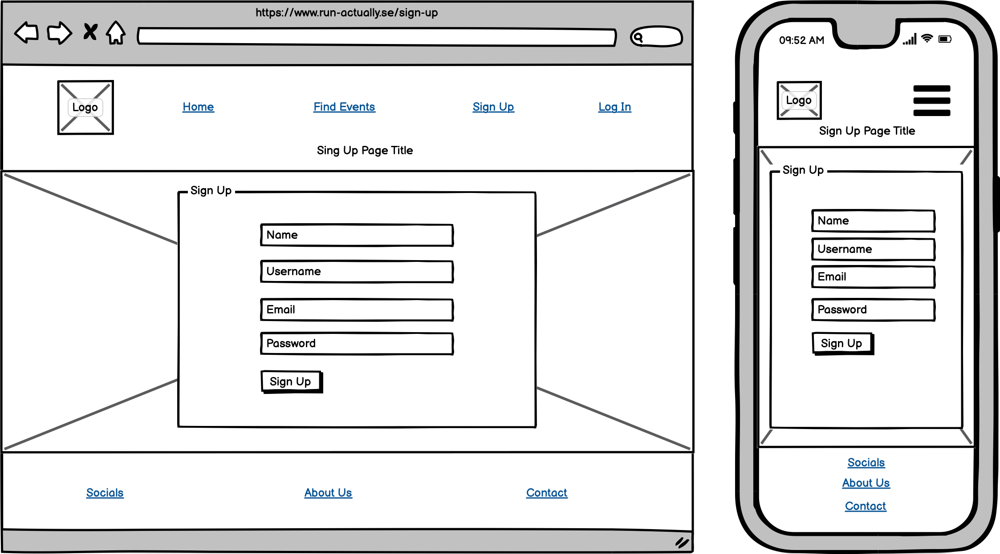

# RUN||actually 

Run actually is a event finder site for people passionate about the art of running fitness & health and in general. I't all about getting people outdoors and active. The live site will be found _**here**_.
### Mockup will be found _**here**_.
## Table of Content
* [User Experience Design (UX)](#User-Experience-Design)
    * [The Strategy Plane](#The-Strategy-Plane)
        * [Site Goals](#Site-Goals)
        * [User stories](#User-Stories)
    * [The Scope Plane](#The-Scope-Plane)
    * [The Structure Plane](#The-Structure-Plane)
    * [The Skeleton Plane](#The-Skeleton-Plane)
        * [Wireframes](#Wireframes)
        * [Database Design](#Database-Design)
        * [Security](#Security)
    * [The Surface Plane](#The-Surface-Plane)
        * [Design](#Design)
            * [Colour Scheme](#Colour-Scheme)
            * [Typography](#Typography)
            * [Imagery](#Imagery)
    * [Differences to Design](#Differences-to-Design)
- [Features](#Features)
    * [Existing Features](#Existing-Features)
    * [Future Features](#Features-Left-to-Implement)
* [Technologies](#Technologies)
* [Testing](#Testing)
    * [Test Strategy](#Test-Strategy)
    * [Test Results](#Test-Results)
    * [Isses and Resolutions](#Issues-and-Resolutions-to-issues-found-during-testing)
* [Deployment](#Deployment)
    * [Project Creation](#Project-Creation)
    * [GitHub Pages](#Deployment-To-Heroku)
    * [Run Locally](#Run-Locally)
    * [Fork Project](#Fork-Project)
* [Credits](#Credits)
  * [Code](#Code)
  * [Acknowledgements](#Acknowledgements)

  ****

## User Experience Design
### **The Strategy Plane**

This website was created for for the sole purpose of compleating my MS3 for the "Code Institue's" full stack software developer program. At the same time I am a avid runnner so I thought it would be cool to create a runners event site that I my self would use to find, create and particapate in the events. The aim is to provide users with a website that allows them to quickly find and sing up for, or create Runners Events that can be shared with other runner enthusiasts. All historical events should be recorded, although they do not have to be displayed as this data will not be needed until phase two enhancements of the website.
#### Site Goals
* To increase the number of participants in runners events by providing a simple, easy to use website that
contains all the details of upcoming events.
* Charities play a vital role in our lives and communities and Charities rely on fundraising to keep doing their work. Taking on a challenge is the perfect opportunity to start fundraising. This site give organizations and/or indivduals the opportunity to create charity runns so support great causes.
* Maintaining good health doesn't happen by accident. It requires work, smart lifestyle choices and Physical exercise. Exercise is important for people with mental illness – it not only boosts our mood, concentration and alertness, but improves our cardiovascular and overall physical health. This site is all about promoting a healther way of life.

#### User stories
* As a user, I want the main purpose of the site to be clear so that I immediately know what the site is 
intended for upon entering.
* As a user, I want to easily navigate the site so that I can find content quickly with ease.
* As a user, I want the website to be responsive so that I can clearly view the webpages from my mobile, 
tablet or desktop.
* As a user, I want to be able to register to the website so that I can create and manage my own events.
* As a user, I want to be able to search or filter events based on custom criteria so that I can find events
 suited to me.
* As a user, I want a way to contact the site owner so that I can have any questions I may have in 
regards to the website answered.
* As a user, I want to be able to return to the main site without having to use the browser buttons so 
that I can easily return to the website if I navigate to a page that doesn't exist.

### **The Scope Plane**

**Features planned:**
* Responsive design.
* Website title and information on the site purpose.
* Navigation Menu (Site Wide).
* Footer with links (Site Wide).
* MongoDB databases to store event information and user login/profile information.
* CRUD Functionality.
* Login functionality.
* Logout functionality.
* Profile Page.
* Edit Profile Page.
* Runners events displayed and searchable to all users.
* Registered user event creation and management.
* Admin ability to add, edit, delete categories.
* Admin ability to delete user account.

### **The Structure Plane**
User Story:
> As a user, I want the main purpose of the site to be clear so that I immediately know what the site is 
intended for upon entering.

Acceptance Criteria:
* Site Logo to be displayed on the main navigation bar on all pages.
* Home Page to display Website Title and information to the user on the purpose of the site.

Implementation:

A site logo will be displayed on the main navigation menu. This should be 
displayed on all webpages.

The Website title will be displated as a h2 element on the home page and a description of the site will be displayed on the Home page so that is evident of the websites purpose as soon as the user visits the site.

User Story:
> As a user, I want to easily navigate the site so that I can find content quickly with ease.

Acceptance Criteria:
* Navigation menu to be displayed on all pages.
* All navigation links redirect to the correct pages.

Implementation:

A navigation menu will be displayed on all webpages. This will redirect users to the approriate page when 
clicked. On smaller devices, the menu will collapse into a hamburger menu to make efficient use to screen 
space. When clicked, the menu will expand out from the right side of the screen displaying all nav items.

The following navigation items will be implemented in the main menu when user is not logged in:

* Home - index.html
* Events - get_events.html
* Sign Up - register.html
* Log In - login.html

The following navigation items will be implemented in the main menu when user is logged in:
* Home - index.html
* Events - get_events.html
* Create Event - create-event.html
* Profile - profile.html
* Log Out - (redirects to home page)

The following navigation buttons will be implemented on the Profile page when user is logged in:
* Edit Profile - profile.html
* Update Profile - edit_profile.html

The following navigation items will be implemented in the footer section they at all time:
* Social Media Links
* About Us - about.html
* Contact - contact.html

User Story:
> As a user, I want the website to be responsive so that I can clearly view the webpages from my mobile, 
tablet or desktop.

Acceptance Criteria:
* Content should be responsive and display clearly on all devices with no horizontal scroll.

Implementation:

Materialize will be used for website layout with suitable column sizes and containers to ensure
that all content is displayed clearly on all devices with no horizonal scroll. Images will be responsive and 
scale to fit screen sizes with no stretch or distortion to ensure clear images are displayed to the user.

User Story:
> As a user, I want to be able to register to the website so that I can create and manage my own events.

Acceptance Criteria:
* Sign up - Login and Logout functionality to be added.
* User must have the ability to create, update and delete their own events.
* User must have a profile page displaying their basic details.
* Creator of an event should have the ability to update or delete the events.

Implementation:

A Sign Up page will be implemented that allows users to register for an account on the website. The username
and password along with basic details for the users account will be stored in a MongoDB database collection 
called users. In order to create or modify events, a user will have to register and login to the website. 
Only the creator of the event will have the ability to update or delete the event, this is to prevent 
unwanted modification or deletion of events by other users. A flash message will be shown to the user to 
alert them whether the update or delete on their event was successful or failed.

A Sign In page will be implemented to allow registered users the ability to login in to their account. 

Once a user has successfully logged in, they will be redirected to their profile page. The users basic 
details will be displayed on their profile, along with any events they have created. The user will be able 
to update or delete their events from the profile page. This page will only be available to logged in users,
this includes the visibility of the navigation menu item.

A Log Out button will be displayed to users who are logged in. When clicked this will sign the user out of the 
website and redirect them to the home page.

A Create Event page will be implemented that will be acessible and visible on the navigation menu to logged 
in users. The user will be able to create an event from this page. The event information will be stored in 
a MongoDB database collection called events and the event categories will be stored in a MongoDB collection 
called categories.

User Story:
> As a user, I want to be able to search or filter events based on custom criteria so that I can find events
 suited to me.

Acceptance Criteria:
* Events must be displayed to all users regardless of being logged in.
* Users should be able to search for events by Date, Location or Event Category.

Implementation:

An Events page will be implemented that is displayed to all users that is accessible to logged in or guests. 
This page will display the next six Runners events from today's date on a materialize collapsible element. In order to make use of space, these events will be collapsable and can be expanded to view details on click.

A search box will be displayed on screen which will allow users to search for events based on Date, Event 
Type or Location. This will return a filtered, full list events for the current search criteria. 
This will be implemented by using a database index that will be created on the MongoDB collection events.

User Story:
> As a user, I want a way to contact the site owner so that I can have any questions I may have in 
regards to the website answered and receive feedback to alert on status of form submission.

Acceptance Criteria:
* Contact page should be added with a contact form. This form should only submit with valid data input.
* Contact form should not submit with invalid data input.
* User should be alerted of success/failure status of form submission.

Implementation:

A contact page will be added that contains a materialize form, this will allow users to contact the site 
owner. The EmailJS API will be used in order to implement this feature and a flash message will be 
displayed to alert the user if the contact form submitted successfully or unsuccessfully.

Validation will be performed on the form to ensure valid data input. The form will not submit if any 
field is blank.

Form Fields:
* Name - Type: Text, required.
* Email - Type: Email, required.
* Comments - Type: TextArea, required.

User Story:
> As a user, I want to be able to return to the main site without having to use the browser buttons so 
that I can easily return to the website if I navigate to a page that doesn't exist.

Acceptance Criteria:
* If a user redirects to the wrong page, an error will display that contains a link to go back to the main 
website.

Implementation:

A custom 404 page will be created so that if a user attempts to nagiate to a page that it not found, an 
error will be displayed. This page will contain a clickable anchor link to allow the user to redirect to 
the main website without needing to use the browser navigation buttons.

### **The Skeleton Plane**
#### Wireframes PNG Format

Home: 
 
404: 
 
Contact: 
 
About: 
 
Create Event: 
 
Edit Event: 
 
Events: 
 
Profile 
 
Edit Profile 
 
Log In: 
 
Sign Up 
 

#### Wireframes PDF Format

* [Home](readme_images/wireframes_pdf/home.pdf)
* [404](readme_images/wireframes_pdf/404.pdf)
* [Contact](readme_images/wireframes_pdf/contact.pdf)
* [About](readme_images/wireframes_pdf/about.pdf)
* [Create Event](readme_images/wireframes_pdf/create-event.pdf)
* [Edit Event](readme_images/wireframes_pdf/edit-event.pdf)
* [Events](readme_images/wireframes_pdf/events.pdf)
* [Profile](readme_images/wireframes_pdf/profile.pdf)
* [Edit Profile](readme_images/wireframes_pdf/edit-profile.pdf)
* [Log In](readme_images/wireframes_pdf/signin.pdf)
* [Sign Up](readme_images/wireframes_pdf/signup.pdf)

#### Database Design
MongoDB Object format examples:

**Collection: categories** 
{ 
_id: unique-value, 
category_name: "Mud Runs" 
}

**Collection: events** 
{ 
_id: unique-value, 
category_name: "5k Runs" 
date: "30 December, 2021" 
event_description: "Just a nice 5k run for the k-9's" 
event_name :"Muddle in puddle" 
is_urgent: "on" 
location: "Helsingborg, Sweden" 
created_by: "Admin 
}

**Collection: users** 
{ 
_id: unique-value, 
name: "ivanmurraineulysses" 
username: "admin" 
eamil: "murraine8@gmail.com" 
password:***************** 
}
#### Security

Database connection details are set up in an [env.py](https://pypi.org/project/env.py/) for development, for 
security reasons this is not uploaded to GitHub so that database and connection details are not visible to 
users. In production these are stored in Heroku. 

### **The Surface Plane**
### Design

#### Planned Colour Scheme
The main background colour is 
 
The main website text is black 
#### Typography
The tag line text on the home page used is 'Permanent Marker' and the font for all Page title used is 'Zilla Slab Highlight' the expanded materialize collapsible element headings use the font 'Nixie One' while the 
rest of the websites content uses the 'Darker Grotesque' font.

#### Imagery
Different background images will be used on all pages displaying diffrent outdoors runners activaties
taken from [Unsplash](https://unsplash.com/). 

The website logo was created using online software from the website [Canva](https://www.canva.com/).

