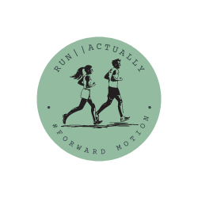
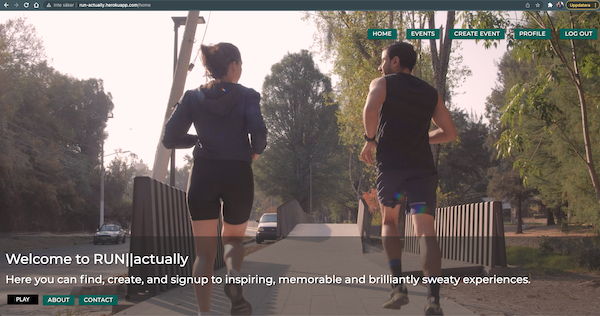
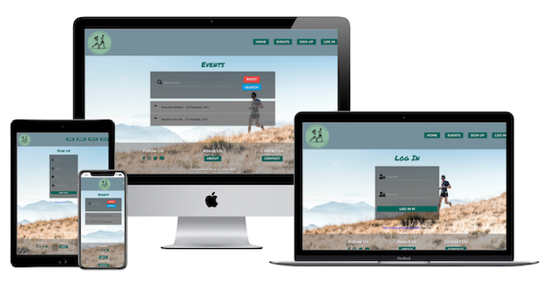
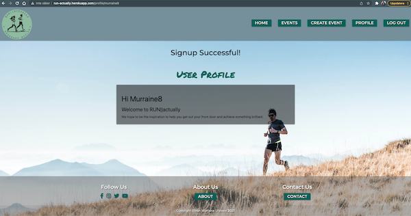
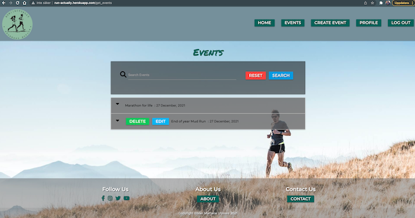
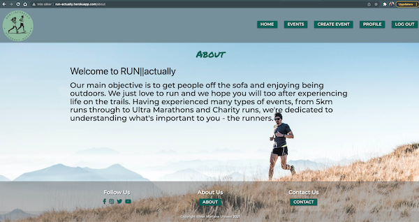
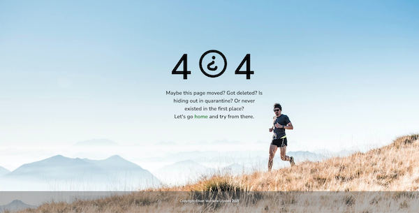
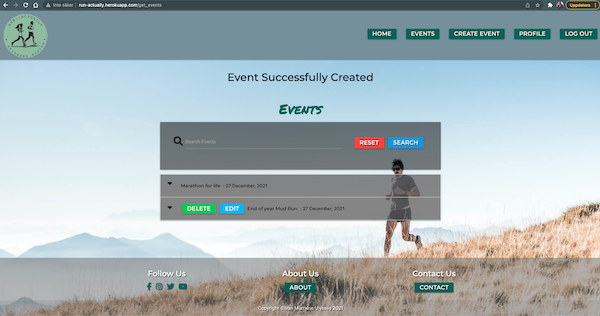
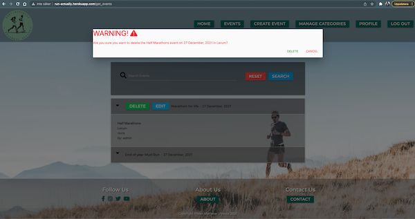
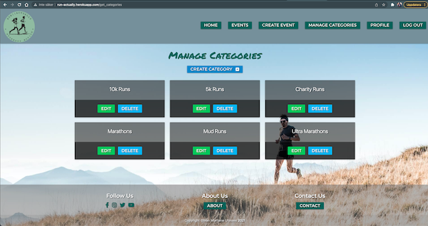

# RUN||actually - Testing

Back to my main README.md click [here](README.md) 
The live site can be found [here](https://run-actually.herokuapp.com/)
 

*Table of Contents** 
1. [User Stories Testing](User-Stories-Testing)  
   - [Unregistered Users' Goals](Unregistered-Users-Goals)   
   - [Registered Users' Goals](Registered-Users-Goals)  
   - [Site Owners Goals](Site-Owners-Goals)    
2. [Manual Testing](Manual-Testing)   
   - [Browser Compatibility](Browser-Compatibility)   
   - [Devices](Devices)   
   - [Responsiveness](Responsiveness)   
   - [Links](Links)  
   - [Forms](Forms)   
   - [Defensive Testing](Defensive-Testing)  
4. [W3C Validator Testing](W3C-Validator-Testing)  
   - [HTML](HTML)   
   - [CSS](CSS)  
5. [JSHint Testing](JSHint-Testing)    
6. [Pep8 Testing](Pep8-Testing)
7. [Lighthouse Testing](Lighthouse-Testing)  

## **1. User Stories Testing**  
### **Unregistered User Goals**   
As a new/ unregistered user, I want to:
1. Be able to search for an event easily
   * As a user, I want the main purpose of the site to be clear so that I immediately know what the site is intended for upon entering.   
   * As a user, I want to easily navigate the site so that I can find content quickly with ease. 
    
   * As a user, I want the website to be responsive so that I can clearly view the webpages from my mobile, tablet or desktop. 
   
    
   
   2. Signup
    * As a user, I want to be able to register to the website so that I can create and manage my own events.
    
     

3. Explore all events.  
   * As a user, I want to be able to search or filter events based on custom criteria so that I can find events  
   
  

4. * As a user, I want a way to contact the site owner so i case have any questions regarding
the website or upcoming races and receive feedback to alert on form submission.
    
  

5. Navigate intuitively and can see the Sign-Up button right away  
   * For unregistered users, the links on Navbar that are available to navigate are: Home, Events,Sign Up, and Log In. The footer is also avalible to a unregistered users, the links in footer that is avalible to all users are: About and Contact. 
    
  
     
  * As a user, I want to be able to return to the main site without having to use the browser buttons so that I can easily return to the website if I navigate to a page that doesn't exist. 
  
  
   
  ### **Registered User Goals**   
1. Understand what the site is about and how it works  
  * On the Profile page, inside the hero-image, a page title website are placed between the navbar and the profile card, and short welcome introduction to the website with a insperational message.
 
2. See all events 
   * On the Events Page, the user can search for all avalible events in the datbase.
   and a signed up user have the ability to create events.
   
  

3. Create events
 * Once logged user have created an event, the user have the ability to to Edit or Delete   said event. 
 
  
 
4. Delete events
   * If a user decides to delete an event a modal will appear and ask user if user is are sure they want to delete the event. Only then can the user delete the event.
 

### **Site Owners Goals**
As Site owner/Admin user, I want to:
1. Be able to create,edit and delete events.
   * All functions as a general user are available for the admin.
    
   
    
    * To increase the number of participants in runners events by providing a simple, easy to use website that
contains all the details of upcoming events.
 
   * Charities play a vital role in our lives and communities and Charities rely on fundraising to keep doing their work. Taking on a challenge is the perfect opportunity to start fundraising. This site give organizations and/or indivduals the opportunity to create charity runns so support great causes.
 
   * Maintaining good health doesn't happen by accident. It requires work, smart lifestyle choices and Physical exercise. Exercise is important for people with mental illness – it not only boosts our mood, concentration and alertness, but improves our cardiovascular and overall physical health. This site is all about promoting a healther way of life.
 

2. Add, Edit, and Delete categories   
   * Once the Site owner/Admin is logged in, a "Manage Categories" button will be visible in the navbar.
    
   
   
 

